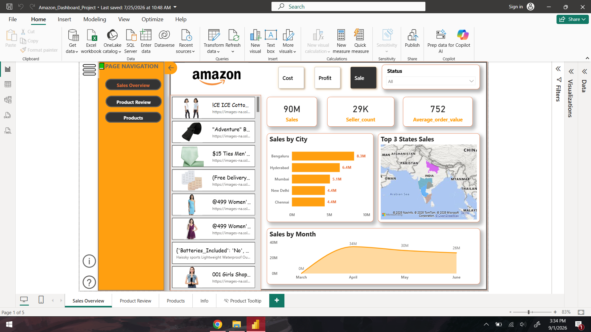
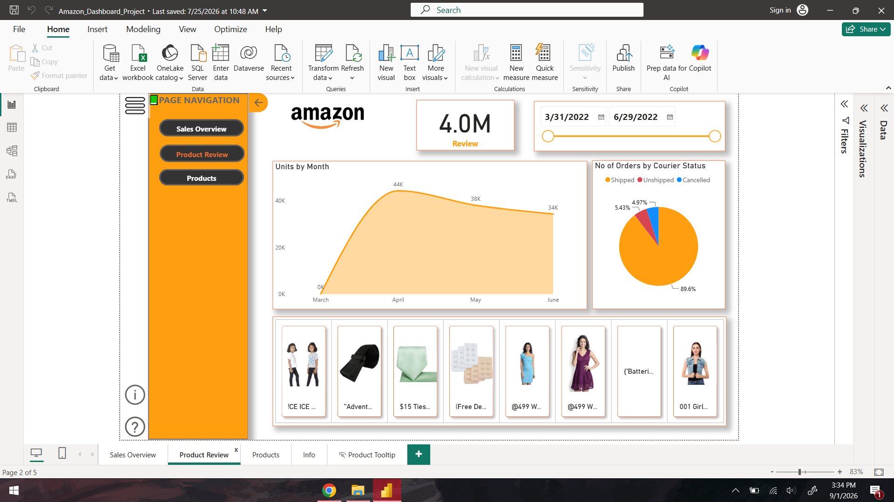
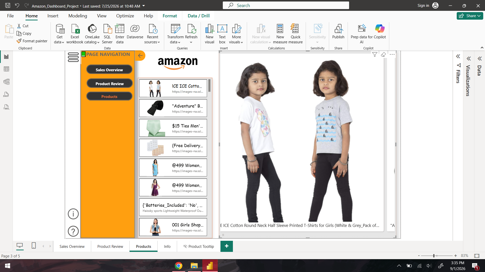
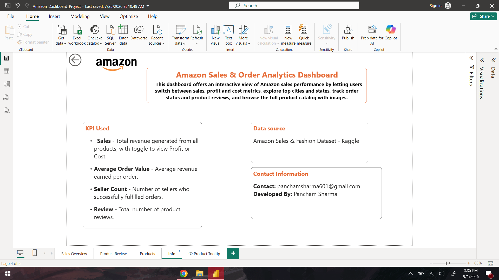

# Amazon Sales Dashboard (Power BI)

A 4-page interactive Power BI dashboard analyzing Amazon sales performance, with a custom hover-tooltip page, DAX measures, and bookmark-based navigation for a polished, presentation-ready experience.

## Features
- **4 navigable pages:** Sales Overview, Product Review, Products, and Info (which explains what the dashboard covers and how to navigate it)
- **Custom Product Tooltip page** — a dedicated Power BI tooltip page that appears on hover over product visuals, showing extra detail without leaving the current page
- **Bookmark-based sidebar navigation** — custom-built page switching using Power BI bookmarks rather than default tabs, for a cleaner, app-like UI
- **Custom DAX measures** for key sales metrics beyond what raw columns provide (e.g. totals, growth, ratios — calculated rather than pre-aggregated in the source data)

## Tech Stack
Power BI Desktop, DAX (CALCULATE, time intelligence, aggregation measures), bookmarks & selection panes for navigation

## Folder Structure
```
├── Amazon_Sales_Dashboard_PanchamSharma.pbix
└── README.md
```

## How to View
1. Download and install [Power BI Desktop](https://powerbi.microsoft.com/desktop/) (free)
2. Open `Amazon_Sales_Dashboard_PanchamSharma.pbix`
3. Use the sidebar navigation (bookmark-driven) to move between the 4 pages; hover over product visuals to see the tooltip page

## Screenshots

**Sales Overview**


**Product Review**


**Products**


**Info**


## Limitations
- Requires Power BI Desktop to open and interact with directly — a live/published version (Power BI Service) would let reviewers explore it in-browser without installing anything
